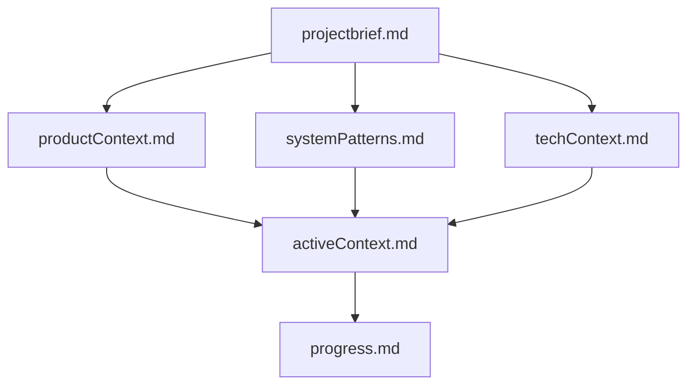

# Memory Bank - Trợ Lý AI HBC

## Giới Thiệu

Thư mục Memory Bank chứa các tài liệu quan trọng mô tả đầy đủ về dự án Trợ Lý AI HBC. Những tài liệu này được thiết kế để cung cấp một hiểu biết toàn diện về dự án, kiến trúc, tiến độ và các quyết định thiết kế.

## Cấu Trúc Memory Bank

Memory Bank được tổ chức theo một cấu trúc phân cấp rõ ràng, với các tệp có mối quan hệ như sau:

## Các Tài Liệu Cốt Lõi

### 1. projectbrief.md

-   **Mô tả**: Tài liệu nền tảng định hình tất cả các tài liệu khác
-   **Nội dung**: Mục tiêu, phạm vi, yêu cầu chính và kết quả mong đợi của dự án
-   **Vai trò**: Là nguồn thông tin chính xác về phạm vi dự án

### 2. productContext.md

-   **Mô tả**: Giải thích bối cảnh kinh doanh và nhu cầu sản phẩm
-   **Nội dung**: Vấn đề hiện tại, giải pháp, đặc điểm người dùng, trải nghiệm mong muốn
-   **Vai trò**: Giúp hiểu rõ lý do tồn tại của sản phẩm và cách nó giải quyết vấn đề

### 3. systemPatterns.md

-   **Mô tả**: Tài liệu về kiến trúc và mẫu thiết kế hệ thống
-   **Nội dung**: Tổng quan kiến trúc, mô hình thành phần, luồng dữ liệu, mẫu thiết kế
-   **Vai trò**: Giải thích cách các thành phần tương tác và nguyên tắc thiết kế được áp dụng

### 4. techContext.md

-   **Mô tả**: Chi tiết về bối cảnh công nghệ của dự án
-   **Nội dung**: Công nghệ cốt lõi, kiến trúc triển khai, thư viện, yêu cầu môi trường
-   **Vai trò**: Cung cấp thông tin về các công nghệ và cách chúng được sử dụng

### 5. activeContext.md

-   **Mô tả**: Thông tin về trạng thái hiện tại và hướng phát triển
-   **Nội dung**: Trạng thái dự án, tính năng hoạt động, quyết định, thách thức, kế hoạch
-   **Vai trò**: Cập nhật tình hình và tập trung phát triển hiện tại

### 6. progress.md

-   **Mô tả**: Theo dõi tiến độ và lộ trình phát triển
-   **Nội dung**: Tính năng đã hoàn thành, đang phát triển, kế hoạch, vấn đề hiện tại
-   **Vai trò**: Giám sát tiến độ và quản lý công việc còn lại

### 7. .cursor/rules

-   **Mô tả**: Quy tắc và hướng dẫn phát triển dự án
-   **Nội dung**: Quy tắc chung, quy ước mã nguồn, lưu ý quan trọng, thông tin đặc biệt
-   **Vai trò**: Đảm bảo nhất quán trong phát triển và duy trì chất lượng code

## Cách Sử Dụng Memory Bank

### Khi Bắt Đầu Làm Việc

1. Đọc `projectbrief.md` để hiểu mục tiêu và phạm vi
2. Tham khảo `productContext.md` để hiểu tại sao dự án quan trọng
3. Xem `activeContext.md` để nắm bắt trạng thái hiện tại và hướng đi
4. Đọc qua `.cursor/rules` để hiểu quy tắc và quy ước

### Khi Phát Triển Tính Năng Mới

1. Tham khảo `systemPatterns.md` để hiểu kiến trúc và mẫu thiết kế
2. Xem xét `techContext.md` để biết công nghệ phù hợp
3. Kiểm tra `progress.md` để định vị tính năng trong lộ trình tổng thể

### Khi Cập Nhật Memory Bank

1. Cập nhật `activeContext.md` với thông tin và quyết định mới
2. Cập nhật `progress.md` với tiến độ và vấn đề mới
3. Theo tình hình, cập nhật các tài liệu khác nếu có thay đổi lớn

## Cập Nhật Memory Bank

Memory Bank cần được cập nhật trong các trường hợp sau:

1. Khi phát hiện mẫu thiết kế mới trong dự án
2. Sau khi triển khai thay đổi quan trọng
3. Khi ngữ cảnh cần làm rõ
4. Khi có yêu cầu cập nhật rõ ràng

Lưu ý: Khi cập nhật, nên xem xét tất cả các tệp trong Memory Bank, tập trung đặc biệt vào `activeContext.md` và `progress.md` để theo dõi trạng thái hiện tại.
